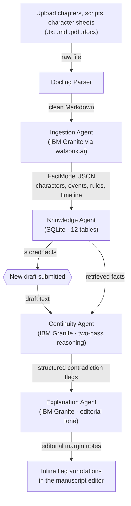

# Continuum


### The creative continuity engine


[](https://github.com/0xkinno/continuum/actions/workflows/ci.yml)

> **Every page checked against everything that came before it.**

Continuum ingests a creator's existing material, builds a living model of their story's truth, and flags what breaks it. Upload your chapters and character sheets. Write a new scene. Continuum tells you that Mira cannot know the binding word yet because Old Thessaly does not teach it until Chapter 6.

**Writers forget. Continuum does not.**

---

## Product Screenshots

<!-- All screenshots should be 1280x800 for consistent rendering -->

| Manuscript workspace | Canon (story bible) |
|---|---|
|  |  |

| Canon characters | History audit log |
|---|---|
|  |  |

---

## Live Links

| Resource | Link |
|---|---|
| **Live Site** | [continuum-ecru-mu.vercel.app](https://continuum-ecru-mu.vercel.app) |
| **Backend API** | [continuum-backend-60wn.onrender.com](https://continuum-backend-60wn.onrender.com) |
| **GitHub** | [github.com/0xkinno/continuum](https://github.com/0xkinno/continuum) |
| **Demo Video** | [Watch on YouTube](#) |
| **Challenge** | IBM AI Builders Challenge, July 2026 |

---

## The problem

Long-form creative work accumulates facts. A novel establishes that a character cannot swim in Chapter 2, gives her a fear of water in Chapter 5, and then needs her to cross a river in Chapter 14. A screenplay builds a timeline across 120 pages. A game bible tracks hundreds of lore entries across dozens of contributors. The longer the work, the more facts exist, and the harder it becomes for any single person to hold them all in their head at once.

Today this problem is solved by human continuity editors, a real and expensive role in film, publishing, and game development. Studios hire them. Publishing houses assign them. Independent creators simply cannot afford them, so contradictions ship. Readers find them. Reviews mention them. The damage is done after the fact, never before.

No existing AI tool addresses this. Writing assistants generate new text. Grammar checkers fix syntax. Neither one reads your previous 200 pages and tells you that a character already knew this information three chapters ago. The gap is not generation. The gap is memory.

---

## The solution

Continuum reads everything you have written, extracts structured facts (characters, traits, events, timeline markers, established rules), and stores them in a queryable knowledge model. When you write new material, Continuum checks every claim in your draft against that model and flags contradictions with a clear, editorial-toned explanation of what broke and where it was established.

Four agents form a sequential pipeline. Each one has a single job.



The output is not a system error. It reads like a note from a continuity editor: "Mira learns the binding word from Old Thessaly in Chapter 6, paragraph 3. As written in this draft, she uses it in Chapter 4. She should not know it yet."

### System diagram


---

## Agent architecture

| Agent | Input | Output | What it does |
|---|---|---|---|
| **Ingestion** | Uploaded file (.txt, .md, .pdf, .docx) | Structured FactModel (JSON) | Parses via Docling, then prompts Granite to extract characters, events, timeline markers, and rules |
| **Knowledge** | FactModel from Ingestion | Stored facts in SQLite | Upserts across 12 tables with deduplication by character name, timeline label, and rule text |
| **Continuity** | New draft text + retrieved facts | Structured contradiction flags | Two-pass Granite reasoning: extract claims, then check each against known facts step by step |
| **Explanation** | Raw contradiction flags | Editorial-toned annotations | Rewrites each flag as a clear note with claim, conflict, source reference, and reasoning |

---

## Views

Continuum ships four views, each with a distinct purpose.

**Manuscript Workspace** (`/`) is the main demo screen. Three zones: an upload panel on the left for ingesting chapters and character sheets, a draft editor in the center where new text is written or pasted, and a margin panel on the right where editorial contradiction notes appear inline next to the flagged text.

**Canon** (`/canon`) is a read-only, magazine-style visualization of the entire story model. Characters are shown as typeset cards with traits, relationships, and chapter appearances. Events are displayed on a vertical timeline. Established rules are listed with the chapter that created them. This is the story bible your AI built from your manuscripts.

**History** (`/history`) logs every continuity check: timestamp, draft excerpt, flag count, and a link to review the full results.

**Landing** (`/landing`) is a single-scroll marketing page with the problem statement, feature grid, architecture diagram, and a call to action.

---

## Tech stack

| Layer | Technology |
|---|---|
| Frontend | Next.js 14 (App Router) . React . TypeScript . CSS Modules . Framer Motion |
| Backend | Node.js . Fastify . TypeScript |
| AI | ibm/granite-4-h-small via watsonx.ai (/ml/v1/text/chat) |
| Document parsing | Docling (Python, called as subprocess) |
| Database | SQLite (Node 24 built-in `node:sqlite`) . 12-table relational schema |
| Fonts | Fraunces (display) . Inter Tight (body) . IBM Plex Mono (labels) |
| Deploy | Vercel (frontend) . Render (backend) |

---

## Repository layout

```
continuum/
├── .github/workflows/         # CI
├── backend/
│   └── src/
│       ├── agents/            # ingestionAgent, knowledgeAgent, continuityAgent, explanationAgent
│       ├── lib/               # db.ts, watsonxClient.ts, doclingParser.ts
│       ├── routes/            # health, ingest, knowledge, continuity, history, seed
│       ├── scripts/           # docling_parse.py, seed-demo.ts
│       ├── seed/demo-data/    # 4 chapters, character sheet, test draft
│       ├── types/             # facts.ts, continuity.ts
│       └── __tests__/         # agent tests
├── docs/
│   ├── adr/                   # 6 architecture decision records
│   ├── screenshots/           # workspace, canon, margin-notes, landing, history, banner
│   ├── BOB.md                 # IBM Bob usage log
│   └── DEMO.md                # judge walkthrough
├── public/images/             # hero and canon-preview imagery
├── src/
│   ├── app/                   # / (workspace), /canon, /history, /landing
│   ├── components/            # Nav, MotionLayout, ArchitectureDiagram
│   ├── lib/                   # api.ts, types.ts
│   └── styles/                # tokens.css, globals.css
├── INSTRUCTIONS.md
└── README.md
```

---

## API endpoints

| Method | Path | What it does |
|---|---|---|
| `GET` | `/health` | Liveness check with service status |
| `POST` | `/ingest/upload` | Upload a file, parse with Docling, extract facts with Granite, store in SQLite |
| `GET` | `/knowledge/query?q=` | Retrieve facts about a character or topic, scoped by chapter |
| `GET` | `/knowledge/sources` | List all ingested documents |
| `POST` | `/continuity/check` | Check a draft against known facts, return explained flags |
| `POST` | `/continuity/explain` | Explain pre-computed flags (standalone) |
| `GET` | `/history/list` | Paginated log of all continuity checks |
| `GET` | `/history/:id` | Full result for a specific check |
| `POST` | `/seed/demo` | Reset and load the demo project |

---

## How IBM Bob was used

Bob was the primary development tool across every phase of this project. A per-session log is kept in [`docs/BOB.md`](docs/BOB.md).

Bob did not "help with coding." It made architectural decisions, diagnosed real bugs, and built every agent, route, component, and test in this repository. Three examples:

**watsonx token caching.** Bob identified that the IAM token exchange was being called on every request instead of caching the bearer token for its 55-minute lifetime. Without the fix, the app would have hit rate limits within minutes of demo use. Fixed by adding an expiry check in `watsonxClient.ts`.

**Docling subprocess bridge.** The spec required Docling (a Python library) in a Node/TypeScript backend. Bob chose a subprocess call (`execFile`) over a separate microservice, reasoning that one process is simpler to debug live, adds no network overhead, and is consistent with the sequential pipeline design. Documented in [ADR-001](docs/adr/ADR-001-docling-subprocess.md).

**Node 24 built-in SQLite.** `better-sqlite3` failed to compile on Node 24 without matching MSVC build tools. Bob switched to the Node 24 native `node:sqlite` (`DatabaseSync`), eliminating native compilation entirely. Documented in [ADR-003](docs/adr/ADR-003-sqlite-fact-store.md).

---

## Architecture decisions

Every load-bearing decision is recorded as an ADR.

| Record | Decision |
|---|---|
| [ADR-001](docs/adr/ADR-001-docling-subprocess.md) | Subprocess bridge for Docling rather than a microservice |
| [ADR-002](docs/adr/ADR-002-sequential-pipeline.md) | Sequential agent pipeline rather than a multi-agent framework |
| [ADR-003](docs/adr/ADR-003-sqlite-fact-store.md) | SQLite for the fact store rather than a vector database |
| [ADR-004](docs/adr/ADR-004-granite-for-reasoning.md) | Granite for structured reasoning, not perception |
| [ADR-005](docs/adr/ADR-005-chat-endpoint.md) | Chat endpoint over deprecated text generation |
| [ADR-006](docs/adr/ADR-006-model-fallback.md) | No silent model fallback to non-IBM models |


---

## Scope and limitations

Stated plainly, because a reviewer will find them anyway.

**Text only.** Audio, video, and image-based stories are out of scope for this version.

**Single-user, no authentication.** The fact store is local SQLite. There is no user login or multi-tenant isolation.

**Continuity checking is not deterministic.** Granite may flag different issues on repeated runs of the same draft. The demo uses a seeded example project with deliberately unambiguous contradictions to ensure reliable demonstration.

**Docling runs as a subprocess.** On cold start, the first upload takes 3 to 5 seconds longer than subsequent ones while the Python process initializes.

**Free-tier rate limits.** watsonx.ai free tier may return 429 under sustained use. The app surfaces this as "services are busy" rather than failing silently.

---

## Running locally

Requirements: Node 20+, Python 3.10+ with `pip install docling`, a watsonx.ai project with an API key.

```bash
git clone https://github.com/0xkinno/continuum.git
cd continuum
```

**1. Backend**

```bash
cd backend
cp .env.example .env          # then fill in your watsonx keys
npm install
npm run dev                    # http://localhost:3001
```

**2. Frontend** (a second terminal)

```bash
cd continuum
cp .env.example .env.local
npm install
npm run dev                    # http://localhost:3000
```

**3. Load the demo project**

Open the workspace at `http://localhost:3000`, click "Load demo project" in the upload panel, then paste the test draft and click "Check continuity." Three flags should appear.

---

## Environment variables

### Backend (`backend/.env`)

| Variable | Required | Purpose |
|---|---|---|
| `WATSONX_API_KEY` | Yes | IBM Cloud IAM API key |
| `WATSONX_PROJECT_ID` | Yes | watsonx.ai project ID |
| `WATSONX_URL` | Yes | watsonx.ai endpoint (default: `https://us-south.ml.cloud.ibm.com`) |
| `WATSONX_MODEL_ID` | No | Model ID (default: `ibm/granite-13b-instruct-v2`) |
| `BACKEND_PORT` | No | Server port (default: `3001`) |

### Frontend (`.env.local`)

| Variable | Required | Purpose |
|---|---|---|
| `NEXT_PUBLIC_API_URL` | Yes | Backend URL (default: `http://localhost:3001`) |

---

## Testing

```bash
cd backend
npm test                       # agent tests
npx tsc --noEmit               # type check

cd ..
npx tsc --noEmit               # frontend type check
npm run build                  # production build
```

---

## Selected challenge theme

**Reimagine Creative Industries with AI.** Continuum addresses how AI can act as a creative partner rather than a content generator. It does not write for you. It reads what you have already written, remembers it, and tells you when new work contradicts it.

---

## License

MIT

---

Built for the IBM AI Builders Challenge, July 2026. Primary development tool: IBM Bob.