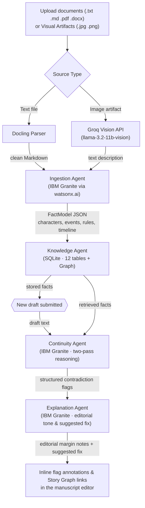

# Continuum


### The AI Canon Intelligence platform for long-form storytelling


[](https://github.com/0xkinno/continuum/actions/workflows/ci.yml)

> **Continuum is an AI Canon Intelligence platform for long-form storytelling.**  
> Instead of treating manuscripts as isolated files, Continuum builds a living canonical knowledge model from every creative artifact—chapters, notes, images, character sheets, and worldbuilding documents—then reasons against that canon to detect contradictions, explain them with evidence, and preserve narrative consistency throughout the lifetime of a story.

**Writers forget. Continuum does not.**

---

## Product Screenshots

| Manuscript workspace | Canon (story bible & story graph) |
|---|---|
|  |  |

| Canon characters | History audit log |
|---|---|
|  |  |

---

## Live Links

| Resource | Link |
|---|---|
| **Live Site** | [continuum-ecru-mu.vercel.app](https://continuum-ecru-mu.vercel.app) |
| **Backend API** | [continuum-backend-60wn.onrender.com](https://continuum-backend-60wn.onrender.com) |
| **GitHub** | [github.com/0xkinno/continuum](https://github.com/0xkinno/continuum) |
| **Challenge** | IBM AI Builders Challenge, July 2026 |

---

## The problem

Long-form creative work accumulates facts. A novel establishes that a character cannot swim in Chapter 2, gives her a fear of water in Chapter 5, and then needs her to cross a river in Chapter 14. A screenplay builds a timeline across 120 pages. A game bible tracks hundreds of lore entries across dozens of contributors. The longer the work, the more facts exist, and the harder it becomes for any single person to hold them all in their head at once.

Today this problem is solved by human continuity editors, a real and expensive role in film, publishing, and game development. Independent creators simply cannot afford them, so contradictions ship. Readers find them. Reviews mention them. The damage is done after the fact, never before.

No existing AI tool addresses this. Writing assistants generate new text. Grammar checkers fix syntax. Neither one reads your previous 200 pages and tells you that a character already knew this information three chapters ago. The gap is not generation. The gap is memory.

---

## The solution

Continuum reads everything you have written or sketched, extracts structured facts (characters, traits, events, timeline markers, established rules), and stores them in a queryable knowledge model. When you write new material, Continuum checks every claim in your draft against that model and flags contradictions with a clear, editorial-toned explanation and a **suggested fix**.

### Multi-modal & Visual Architecture



### System diagram


---

## Key Features

1. **Multimodal Ingestion (Text & Images)**: Supports `.txt`, `.md`, `.pdf`, `.docx`, as well as visual artifacts (`.jpg`, `.png`). Groq Vision describes visual elements (clothing, expressions, setting, narrative objects) which are then processed by IBM Granite to extract canonical facts.
2. **Visual Story Graph**: Explore character appearances, relationships (grouped by type), possessions, knowledge timelines, and event timelines in a clean editorial 4-column layout.
3. **Enhanced Editorial Reasoning & Suggested Fixes**: Every contradiction flag includes a 1-sentence concrete fix recommendation (e.g. *"Have Aldric sheath the iron key before Maren pours salt water."*) alongside explicit percentage confidence scores (`HIGH 90%`, `MEDIUM 65%`, `LOW 40%`).
4. **Direct Contradiction-to-Graph Navigation**: Click *"View in Story Graph →"* on any manuscript flag to instantly jump to that character's narrative graph in Canon.

---

## Environment Configuration

Copy `backend/.env.example` to `backend/.env`:

```bash
WATSONX_API_KEY=your-ibm-cloud-iam-api-key
WATSONX_PROJECT_ID=your-watsonx-project-id
WATSONX_URL=https://eu-de.ml.cloud.ibm.com
WATSONX_MODEL_ID=ibm/granite-4-h-small
BACKEND_PORT=3001
FRONTEND_URL=http://localhost:3000

# Required only for image ingestion. Text-only use does not need this key.
GROQ_API_KEY=your-groq-api-key
```

---

## Architecture Decisions (ADRs)

| ADR | Title |
|---|---|
| [ADR-001](docs/adr/ADR-001-fastify-backend.md) | Dedicated Fastify backend over Next.js API routes |
| [ADR-002](docs/adr/ADR-002-sqlite-fact-store.md) | SQLite with 12 structured tables over vector store |
| [ADR-003](docs/adr/ADR-003-two-pass-continuity.md) | Two-pass continuity checking over single-prompt extraction |
| [ADR-004](docs/adr/ADR-004-docling-parser.md) | Docling parser over custom text splitters |
| [ADR-005](docs/adr/ADR-005-chat-endpoint.md) | Chat endpoint over deprecated text generation |
| [ADR-006](docs/adr/ADR-006-model-fallback.md) | No silent model fallback (Scoped exception for Groq Vision image description) |