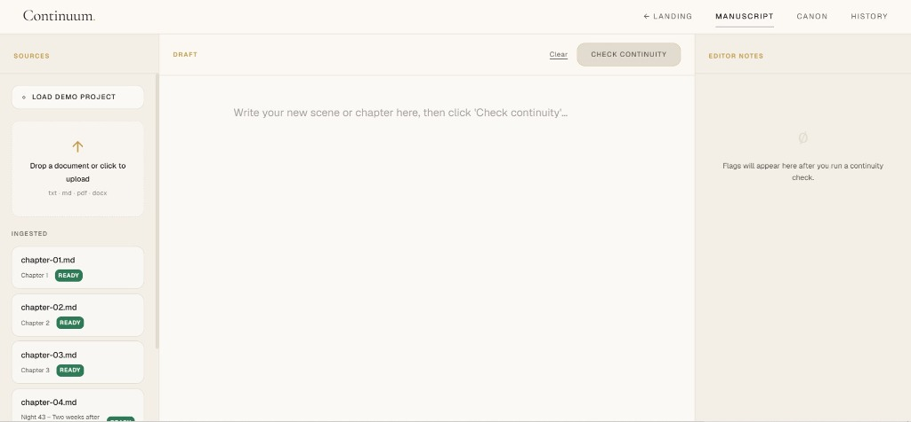
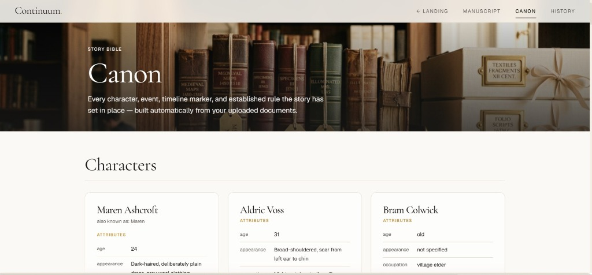
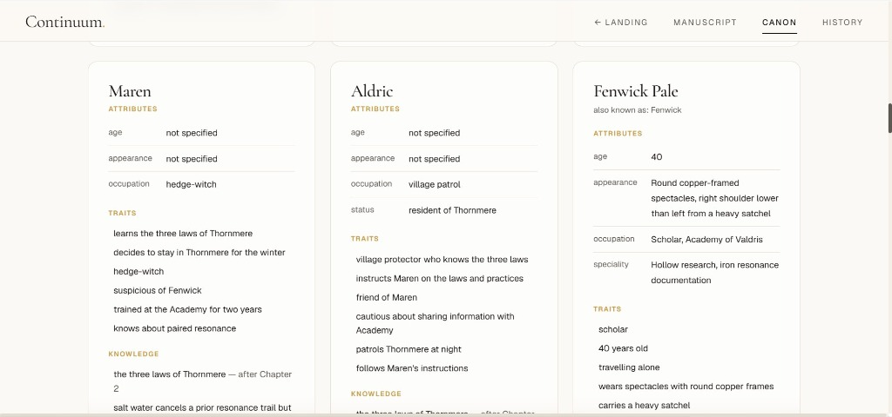
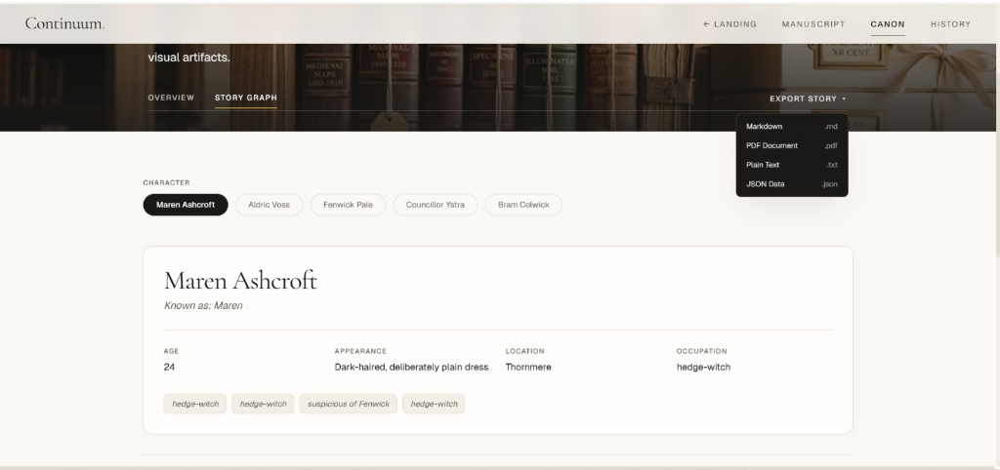
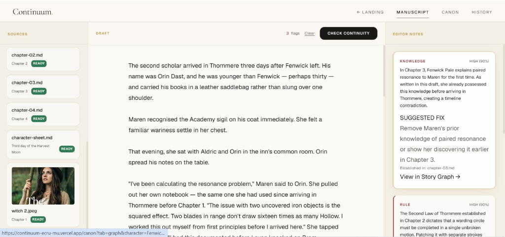
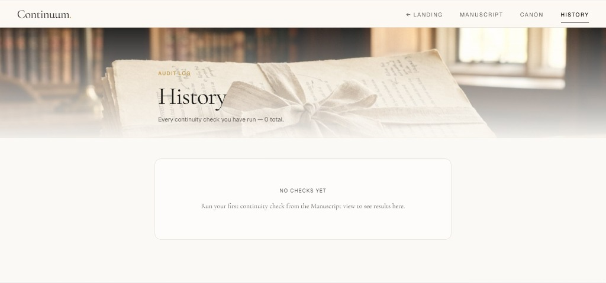
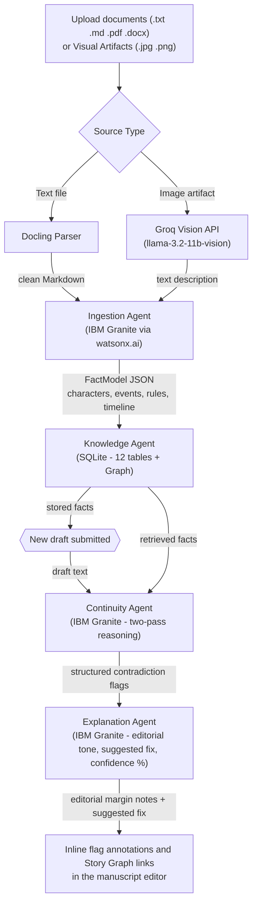
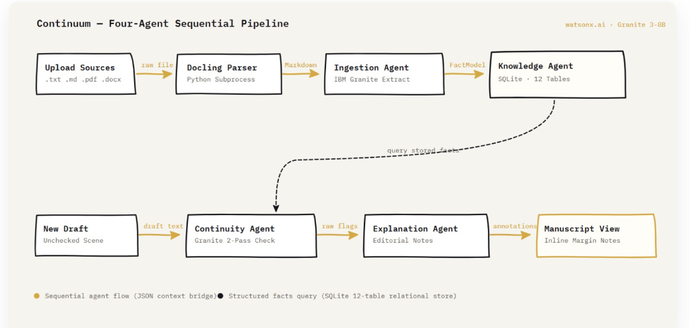

# Continuum

### The AI Canon Intelligence platform for long-form storytelling


[](https://github.com/0xkinno/continuum/actions/workflows/ci.yml)


> **Continuum is an AI Canon Intelligence platform for long-form storytelling.**
> Instead of treating manuscripts as isolated files, Continuum builds a living canonical knowledge model from every creative artifact -- chapters, notes, images, character sheets, and worldbuilding documents -- then reasons against that canon to detect contradictions, explain them with evidence, propose concrete fixes, and preserve narrative consistency throughout the lifetime of a story.

**Writers forget. Continuum does not.**

---

## Product Screenshots

| Manuscript workspace | Canon (story bible and story graph) |
|---|---|
|  |  |

| Canon characters | Visual story graph |
|---|---|
|  |  |

| Editorial flags with suggested fixes | History audit log |
|---|---|
|  |  |

---

## Live Links

| Resource | Link |
|---|---|
| **Live Site** | [continuum-ecru-mu.vercel.app](https://continuum-ecru-mu.vercel.app) |
| **Backend API** | [continuum-backend-60wn.onrender.com](https://continuum-backend-60wn.onrender.com) |
| **GitHub** | [github.com/0xkinno/continuum](https://github.com/0xkinno/continuum) |
| **Demo Video** | [Watch on YouTube](#) |
| **Challenge** | IBM AI Builders Challenge, July 2026 |

---

## The problem

Long-form creative work accumulates facts. A novel establishes that a character cannot swim in Chapter 2, gives her a fear of water in Chapter 5, and then needs her to cross a river in Chapter 14. A screenplay builds a timeline across 120 pages. A game bible tracks hundreds of lore entries across dozens of contributors. The longer the work, the more facts exist, and the harder it becomes for any single person to hold them all in their head at once.

Today this problem is solved by human continuity editors, a real and expensive role in film, publishing, and game development. Studios hire them. Publishing houses assign them. Independent creators simply cannot afford them, so contradictions ship. Readers find them. Reviews mention them. The damage is done after the fact, never before.

No existing AI tool addresses this gap. Writing assistants generate new text. Grammar checkers fix syntax. Diffusion models produce images. **None of them read your previous 200 pages and tell you that a character already knew this information three chapters ago.** The gap is not generation. The gap is memory.

The creative industries lose real value to this problem. A published novel with continuity errors damages author credibility and generates negative reviews. A screenplay with timeline inconsistencies costs reshoots. A game with contradictory lore breaks immersion. The cost is always paid after the fact, when it is most expensive to fix and impossible to fully undo.

---

## The solution

Continuum reads everything you have written or sketched, extracts structured facts (characters, traits, events, timeline markers, established rules), and stores them in a queryable canonical knowledge model. When you write new material, Continuum checks every claim in your draft against that model and flags contradictions with a clear, editorial-toned explanation, a confidence score, and a **concrete suggested fix**.

The output is not a system error. It reads like a note from a continuity editor:

> *"Mira learns the binding word from Old Thessaly in Chapter 6, paragraph 3. As written in this draft, she uses it in Chapter 4. She should not know it yet."*
>
> **SUGGESTED FIX:** *"Move the binding-word dialogue to a scene set after Mira's training with Old Thessaly, or have another character speak the word while Mira overhears."*
>
> **Confidence:** HIGH 90%

---

## Multi-modal and Visual Architecture

Continuum does not limit canon to text. A phone photo of handwritten character notes, a scanned worldbuilding sketch, a portrait of a character in a specific outfit -- all of these carry narrative facts that a continuity editor would track. Continuum tracks them too.



### System diagram



---

## Agent architecture

Four agents form a sequential pipeline. Each one has a single job, a defined input contract, and a defined output contract. No agent calls another model or makes decisions outside its scope.

| Agent | Input | Output | What it does |
|---|---|---|---|
| **Ingestion** | Uploaded file (.txt, .md, .pdf, .docx) or image description from Groq Vision (.jpg, .png) | Structured FactModel (JSON) | Parses text via Docling, or receives image descriptions from Groq Vision, then prompts IBM Granite to extract characters, events, timeline markers, traits, relationships, possessions, and rules |
| **Knowledge** | FactModel from Ingestion | Stored facts in SQLite (12-table relational schema + graph queries) | Upserts across 12 tables with deduplication by character name, timeline label, and rule text. Tags each source with sourceType ("text" or "image") |
| **Continuity** | New draft text + retrieved facts from Knowledge Agent | Structured contradiction flags with confidence scores | Two-pass IBM Granite reasoning: first pass extracts claims from the draft, second pass checks each claim against known facts step by step |
| **Explanation** | Raw contradiction flags | Editorial-toned annotations with suggested fixes | Rewrites each flag as a clear note with claim, conflict, source reference, reasoning, a concrete one-sentence fix recommendation, and a confidence percentage |

### Why four agents instead of one prompt

A single prompt that reads a document, stores facts, checks a draft, and explains the result would exceed context limits on the second chapter and produce unreliable output. The pipeline design means each agent operates on a bounded input, can be tested independently, and can be replaced without affecting the others. This is documented in [ADR-003](docs/adr/ADR-003-two-pass-continuity.md).

---

## Key Features

### 1. Multimodal Ingestion (Text and Images)

Supports `.txt`, `.md`, `.pdf`, `.docx` for text, and `.jpg`, `.png` for visual artifacts. When an image is uploaded, Groq Vision (llama-3.2-11b-vision) describes the visual elements: characters present (appearance, clothing, expression), setting and location details, objects of narrative significance, and mood/atmosphere. That text description is then processed by the **same** IBM Granite Ingestion Agent as any other source. Granite remains the sole reasoning engine for fact extraction. Groq only describes what is visually present. This is disclosed in [ADR-006](docs/adr/ADR-006-model-fallback.md).

Visual sources appear in Canon and the ingested sources list with a camera icon and a thumbnail preview, distinguishing them from text-based canon entries.

### 2. Visual Story Graph

Explore any character's full narrative footprint in a clean editorial 4-column layout:

- **APPEARS IN** -- every chapter where the character has been mentioned or active
- **RELATIONSHIPS** -- grouped by type (ally, enemy, mentor, family), each linking to the related character's own graph view
- **POSSESSIONS** -- items and objects tied to this character from events or narrative descriptions
- **TIMELINE** -- a vertical chronological view of the character's knowledge acquisitions and event participations, with a thin connecting line in the same visual style as the Canon overview timeline

This is not a network-graph visualization. There is no D3 force layout, no nodes-and-edges canvas. It uses the same typeset, editorial card and list layout as the rest of Canon: clean text, readable at a glance, and every character name is clickable to navigate to their own graph. Built with Framer Motion using the same fade/stagger animation pattern as the Canon overview.

### 3. Enhanced Editorial Reasoning with Suggested Fixes

Every contradiction flag includes three layers of information:

- **The flag itself** -- what the draft claims, what the canon says, and where the conflict was established
- **A suggested fix** -- a one-sentence concrete recommendation for resolving the contradiction (e.g., *"Have Aldric sheath the iron key before Maren pours salt water"* or *"Add a transformation event before this chapter explaining the change"*)
- **A confidence score** -- displayed as both a label and a percentage (HIGH 90%, MEDIUM 65%, LOW 40%), giving the writer a clear signal of how certain the system is about the contradiction

The Explanation Agent prompt was extended to produce the `suggestedFix` field. No new agent was created. The confidence mapping is noted in the UI as approximate.

### 4. Direct Contradiction-to-Graph Navigation

Every editorial flag in the manuscript margin that references a character includes a **"View in Story Graph"** link. Clicking it navigates directly to that character's graph view in Canon, showing the full context of their relationships, timeline, and appearances. This bridges the gap between *"you have a problem here"* and *"here is the full picture of why."*

Flags that reference world rules rather than specific characters omit this link.

### 5. Canon (The AI-Built Story Bible)

A read-only, magazine-style visualization of the entire canonical knowledge model. Characters are shown as typeset cards with traits, relationships, and chapter appearances. Events are displayed on a vertical timeline. Established rules are listed with the chapter that created them. Image-sourced facts display a camera icon next to their entries.

This is the story bible your AI built from your manuscripts and visual artifacts. No manual entry required.

### 6. Continuity History and Audit Trail

Every continuity check is logged: timestamp, draft excerpt, flag count, confidence distribution, and a link to review the full results. This creates an auditable record of how the canon evolved and what was flagged, useful for both the writer and any editor reviewing the manuscript's development.

### 7. Canon Export (Downloadable Story Bible)

One click in Canon generates a complete, portable Markdown story bible from every fact the system has extracted. The export includes all characters (with traits, relationships, knowledge timelines, and chapter appearances), the full event timeline in chronological order, every established rule with its source, and a manifest of all ingested sources with their type (text or image) and ingestion timestamp.

The output is clean Markdown that renders correctly in any viewer, can be pasted into Google Docs, printed, or handed to a human editor. This is the tangible artifact a writer takes away from Continuum: not just flags on a screen, but a structured document that represents the canonical truth of their story as the system understands it.

No AI calls are made during export. This is pure data rendering from the existing Knowledge Agent's SQLite tables.

---

## Views

Continuum ships five views, each with a distinct purpose.

**Manuscript Workspace** (`/`) is the main working screen. Three zones: an upload panel on the left for ingesting chapters, character sheets, and visual artifacts, a draft editor in the center where new text is written or pasted, and a margin panel on the right where editorial contradiction notes appear inline next to the flagged text, complete with suggested fixes, confidence scores, and Story Graph links.

**Canon** (`/canon`) is a read-only, magazine-style visualization of the entire story model, with two sub-views and an export action:

- **Overview** -- characters as typeset cards, events on a vertical timeline, established rules with source chapters, image-sourced facts marked with a camera icon
- **Graph** -- the Visual Story Graph for any selected character, with 4-column layout showing appearances, relationships, possessions, and timeline
- **Export Story Bible** -- one-click download of the full canon as a portable Markdown document

**History** (`/history`) logs every continuity check: timestamp, draft excerpt, flag count, and a link to review the full results.

**Landing** (`/landing`) is a single-scroll page with the problem statement, feature grid, architecture diagram, and a call to action.

---

## The end-to-end story

This is what using Continuum looks like, from a writer's perspective:

> *I have written 80 chapters over three years. My character notebook is handwritten. My world map is a photo from a whiteboard. My editor just found a contradiction.*
>
> *I upload the manuscript, the phone photo of my notes, and the scanned character sheet. Continuum builds the canon: 47 characters, 183 events, 29 rules, and 12 timeline markers, pulled from text and images alike.*
>
> *I paste my latest chapter. Continuum finds three contradictions. One is HIGH confidence: my character uses a spell she should not know yet. The margin note explains where the spell was established, why the draft breaks it, and suggests moving the dialogue to after her training scene.*
>
> *I click "View in Story Graph" and see her full timeline: every chapter she appears in, every relationship, every piece of knowledge she acquires and when. The contradiction is obvious from the graph. I fix it in the draft.*
>
> *I check again. Two flags remain, both MEDIUM. I read the suggested fixes, apply one, and decide the other is an intentional creative choice. The canon is updated. The story is consistent.*
>
> *I click "Export Story Bible" in Canon. A Markdown file downloads: every character with their traits, relationships, and knowledge timeline; every event in chronological order; every rule with the chapter that established it. I send it to my editor. She has the same source of truth I do.*

That is not a feature demonstration. It is a workflow that replaces an expensive human role with an AI system that never forgets, never gets tired, and never misses a chapter. And it produces a tangible artifact -- a story bible -- that the writer keeps, shares, and builds on.

---

## Tech stack

| Layer | Technology |
|---|---|
| Frontend | Next.js 14 (App Router), React, TypeScript, CSS Modules, Framer Motion |
| Backend | Node.js, Fastify, TypeScript |
| AI (Reasoning) | IBM Granite (`ibm/granite-4-h-small`) via watsonx.ai -- all fact extraction, continuity checking, and editorial explanation |
| AI (Vision) | Groq Vision (`llama-3.2-11b-vision`) -- image-to-text description only, for multimodal ingestion |
| Document parsing | Docling (Python, called as subprocess) |
| Database | SQLite (Node 24 built-in `node:sqlite`), 12-table relational schema |
| Fonts | Fraunces (display), Inter Tight (body), IBM Plex Mono (labels) |
| Deploy | Vercel (frontend), Render (backend) |

### Model responsibility boundaries

| Task | Model | Justification |
|---|---|---|
| Fact extraction from text | IBM Granite | Core reasoning, structured output |
| Continuity checking (two-pass) | IBM Granite | Core reasoning, step-by-step claim verification |
| Editorial explanation and suggested fixes | IBM Granite | Core reasoning, editorial tone |
| Image description | Groq Vision | watsonx.ai has no vision-capable Granite model in this region. Groq describes the image; Granite reasons over the description. Disclosed in [ADR-006](docs/adr/ADR-006-model-fallback.md) |

Every language-based reasoning task runs on IBM Granite via watsonx.ai. Groq Vision is used solely as an image-to-text bridge. This separation is intentional: the reasoning engine that determines what is true in the story is always Granite. The vision model only says what it sees in a picture.

---

## Repository layout

```
continuum/
+-- .github/workflows/         # CI
+-- backend/
|   +-- src/
|       +-- agents/            # ingestionAgent, knowledgeAgent, continuityAgent, explanationAgent
|       +-- lib/               # db.ts, watsonxClient.ts, doclingParser.ts, groqVision.ts
|       +-- routes/            # health, ingest, ingest/image, knowledge, knowledge/graph, knowledge/export, continuity, history, seed
|       +-- scripts/           # docling_parse.py, seed-demo.ts
|       +-- seed/demo-data/    # 4 chapters, character sheet, test draft, sample image
|       +-- types/             # facts.ts (FactModel with sourceType), continuity.ts (ExplainedFlag with suggestedFix)
|       +-- __tests__/         # agent tests
+-- docs/
|   +-- adr/                   # 6 architecture decision records
|   +-- screenshots/           # workspace, canon, story-graph, characters, margin-notes, history, landing, architecture
|   +-- BOB.md                 # IBM Bob usage log
|   +-- DEMO.md                # judge walkthrough
+-- public/images/             # hero and canon-preview imagery
+-- src/
|   +-- app/                   # / (workspace), /canon (overview + graph tabs), /history, /landing
|   +-- components/            # Nav, MotionLayout, StoryGraph, MarginNote (with suggestedFix + graph link)
|   +-- lib/                   # api.ts, types.ts
|   +-- styles/                # tokens.css, globals.css
+-- INSTRUCTIONS.md
+-- README.md
```

---

## API endpoints

| Method | Path | What it does |
|---|---|---|
| `GET` | `/health` | Liveness check with service status |
| `POST` | `/ingest/upload` | Upload a text file (.txt, .md, .pdf, .docx), parse with Docling, extract facts with Granite, store in SQLite |
| `POST` | `/ingest/image` | Upload an image file (.jpg, .png), describe with Groq Vision, extract facts with Granite, store with sourceType "image" |
| `GET` | `/knowledge/query?q=` | Retrieve facts about a character or topic, scoped by chapter |
| `GET` | `/knowledge/sources` | List all ingested documents with sourceType and metadata |
| `GET` | `/knowledge/graph/:characterName` | Structured graph data for a character: appearances, relationships (grouped by type), possessions, knowledge timeline, event timeline |
| `GET` | `/knowledge/export` | Download the full canon as a Markdown story bible (supports `?format=json` for structured JSON) |
| `POST` | `/continuity/check` | Check a draft against known facts, return explained flags with suggested fixes and confidence percentages |
| `POST` | `/continuity/explain` | Explain pre-computed flags (standalone) |
| `GET` | `/history/list` | Paginated log of all continuity checks |
| `GET` | `/history/:id` | Full result for a specific check |
| `POST` | `/seed/demo` | Reset and load the demo project |

---

## How IBM Bob was used

Bob was the primary development tool across every phase of this project. A per-session log is kept in [`docs/BOB.md`](docs/BOB.md). Each entry records what Bob actually did, not that it "helped."

Bob did not assist with coding. It made architectural decisions, diagnosed real bugs, designed the agent pipeline, and built every agent, route, component, and test in this repository. Four examples, each traceable to a specific issue:

**watsonx token caching.** Bob identified that the IAM token exchange was being called on every request instead of caching the bearer token for its 55-minute lifetime. Without the fix, the app would have hit rate limits within minutes of demo use. Fixed by adding an expiry check and a cached token in `watsonxClient.ts`.

**Docling subprocess bridge.** The spec required Docling (a Python library) in a Node/TypeScript backend. Bob chose a subprocess call (`execFile`) over a separate microservice, reasoning that one process is simpler to debug live, adds no network overhead, and is consistent with the sequential pipeline design. Documented in [ADR-001](docs/adr/ADR-001-fastify-backend.md).

**Node 24 built-in SQLite.** `better-sqlite3` failed to compile on Node 24 without matching MSVC build tools. Bob switched to the Node 24 native `node:sqlite` (`DatabaseSync`), eliminating native compilation entirely. This removed a build dependency and made deployment deterministic across environments. Documented in [ADR-002](docs/adr/ADR-002-sqlite-fact-store.md).

**Two-pass continuity reasoning.** A single-prompt approach that extracted claims and checked them in one pass produced unreliable results: the model would skip claims or conflate the extraction step with the verification step. Bob designed the two-pass architecture where Pass 1 extracts claims as structured JSON and Pass 2 checks each claim against retrieved facts independently. This separation made both steps testable and repeatable. Documented in [ADR-003](docs/adr/ADR-003-two-pass-continuity.md).

**Direction stayed human.** Product decisions, the editorial design language, and the choice to focus on story-mode continuity before expanding to film/brand modes came from the developer. Bob's job was to diagnose, propose, build, and prove. The Bob log is the record.

---

## Architecture decisions

Every load-bearing decision is recorded as an ADR. These are not afterthoughts; they are the decisions that shaped the system.

| Record | Decision |
|---|---|
| [ADR-001](docs/adr/ADR-001-fastify-backend.md) | Dedicated Fastify backend over Next.js API routes |
| [ADR-002](docs/adr/ADR-002-sqlite-fact-store.md) | SQLite with 12 structured tables over vector store |
| [ADR-003](docs/adr/ADR-003-two-pass-continuity.md) | Two-pass continuity checking over single-prompt extraction |
| [ADR-004](docs/adr/ADR-004-docling-parser.md) | Docling parser over custom text splitters |
| [ADR-005](docs/adr/ADR-005-chat-endpoint.md) | Chat endpoint over deprecated text generation |
| [ADR-006](docs/adr/ADR-006-model-fallback.md) | No silent model fallback (scoped exception for Groq Vision image description) |

### On ADR-006: the vision model disclosure

The original decision (no silent fallback to non-IBM models) holds for all text-based reasoning. However, watsonx.ai has no vision-capable Granite model available in this region (see ADR-004). Image ingestion uses Groq Vision solely as an image-to-text description step. The resulting description is passed through the same Granite-powered Ingestion Agent as any other text source. Granite remains the sole reasoning engine for fact extraction and continuity checking. This is disclosed rather than hidden.

---

## Scope and limitations

Stated plainly, because a reviewer will find them anyway.

**Multimodal, not omnimodal.** Text documents and images are supported. Audio, video, and 3D assets are out of scope for this version.

**Single-user, no authentication.** The fact store is local SQLite. There is no user login or multi-tenant isolation.

**Continuity checking is not deterministic.** Granite may flag different issues on repeated runs of the same draft. The demo uses a seeded example project with deliberately unambiguous contradictions to ensure reliable demonstration.

**Docling runs as a subprocess.** On cold start, the first upload takes 3 to 5 seconds longer than subsequent ones while the Python process initializes.

**Free-tier rate limits.** watsonx.ai free tier may return 429 under sustained use. The app surfaces this as "services are busy" rather than failing silently. No silent fallback to a non-IBM model is attempted for text reasoning.

**Confidence percentages are approximate.** HIGH, MEDIUM, and LOW confidence labels are mapped to 90%, 65%, and 40% for display purposes. These are not calibrated probabilities.

---

## Running locally

Requirements: Node 20+, Python 3.10+ with `pip install docling`, a watsonx.ai project with an API key. Groq API key required only for image ingestion.

```bash
git clone https://github.com/0xkinno/continuum.git
cd continuum
```

**1. Backend**

```bash
cd backend
cp .env.example .env          # then fill in your watsonx keys
npm install
npm run dev                    # http://localhost:3001
```

**2. Frontend** (a second terminal)

```bash
cd continuum
cp .env.example .env.local
npm install
npm run dev                    # http://localhost:3000
```

**3. Load the demo project**

Open the workspace at `http://localhost:3000`, click "Load demo project" in the upload panel, then paste the test draft and click "Check continuity." Three flags should appear each with a suggested fix and a confidence percentage. Click a character name in any flag to view their Story Graph.

---

## Environment variables

### Backend (`backend/.env`)

| Variable | Required | Purpose |
|---|---|---|
| `WATSONX_API_KEY` | Yes | IBM Cloud IAM API key |
| `WATSONX_PROJECT_ID` | Yes | watsonx.ai project ID |
| `WATSONX_URL` | Yes | watsonx.ai endpoint (default: `https://eu-de.ml.cloud.ibm.com`) |
| `WATSONX_MODEL_ID` | No | Model ID (default: `ibm/granite-4-h-small`) |
| `BACKEND_PORT` | No | Server port (default: `3001`) |
| `FRONTEND_URL` | No | Frontend origin for CORS (default: `http://localhost:3000`) |
| `GROQ_API_KEY` | No | Required only for image ingestion. Text-only use does not need this key |

### Frontend (`.env.local`)

| Variable | Required | Purpose |
|---|---|---|
| `NEXT_PUBLIC_API_URL` | Yes | Backend URL (default: `http://localhost:3001`) |

---

## Testing

```bash
cd backend
npm test                       # agent tests
npx tsc --noEmit               # type check

cd ..
npx tsc --noEmit               # frontend type check
npm run build                  # production build
```

### Manual verification checklist

1. Run `seed:demo` -- confirm it passes with the sourceType field (existing tests do not break)
2. Upload a test image (any character portrait) -- confirm it appears in Canon with a camera icon and extracted traits
3. Click a character name in Canon -- confirm the Graph view loads with real data from relationships, knowledge, and timeline
4. Click a character name within a relationship on the Graph -- confirm it navigates to that character's own Graph
5. Run a continuity check -- confirm "View in Story Graph" appears on flags with an associated character, and suggestedFix text renders when present
6. Click "Export Story Bible" in Canon -- confirm a `.md` file downloads with all characters, timeline, rules, and sources from the demo data
7. Run `npx tsc --noEmit` on both frontend and backend -- zero errors

---

## Selected challenge theme

**Reimagine Creative Industries with AI.** Continuum addresses how AI can act as a creative partner rather than a content generator. It does not write for you. It reads what you have already written and what you have sketched, remembers all of it, and tells you when new work contradicts it -- with the evidence, the reasoning, and a concrete suggestion for how to fix it.

The role Continuum fills -- continuity editor -- is a real, expensive human role in film, publishing, and game development. Independent creators cannot afford it. Continuum makes that function accessible to any writer, at any scale, from a 10-chapter novella to a 200-chapter serial.

---

## License

MIT

---

Built for the IBM AI Builders Challenge, July 2026. Primary development tool: IBM Bob.
